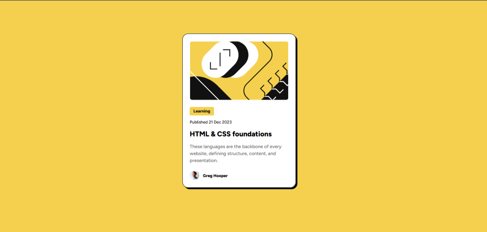

# Frontend Mentor - Blog preview card solution

This is a solution to the [Blog preview card challenge on Frontend Mentor](https://www.frontendmentor.io/challenges/blog-preview-card-ckPaj01IcS). Frontend Mentor challenges help you improve your coding skills by building realistic projects. 

### Screenshot

### Links

- Live Site URL: [Live site here](https://your-live-site-url.com)

## My process

### Built with

- HTML
- CSS

### Useful resources

- [resource 1](https://www.w3schools.com/cssref/css3_pr_box-shadow.php) - This helped me for create shadow.

